# Tunnel Checkers

This a version of the game of Checkers. All [original game rules](https://en.wikipedia.org/wiki/Draughts) are still vaild. However, in Tunnel Checkers, any checker piece at lateral boundaries can be played so that it will end up on the other lateral side of the game board as if the board is a tunnel. The "Tunnel" part of the title comes from that aspect of this version of Checkers.

## Game Screenshots

### Start


### After window size selection
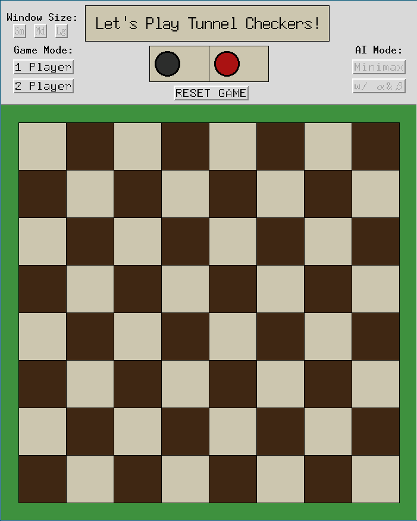

### After 1Player and Minimax mode selection
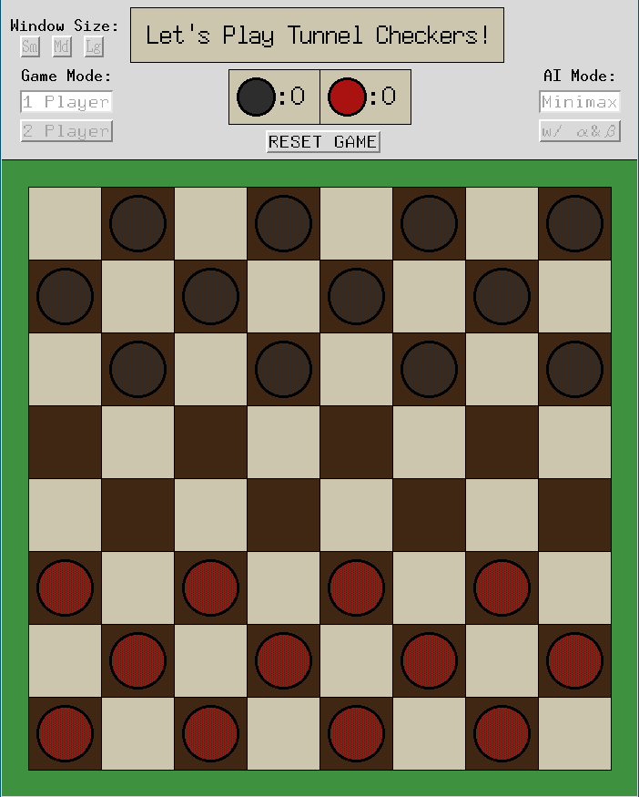

### After 2Player mode selection


### Selected piece move preview
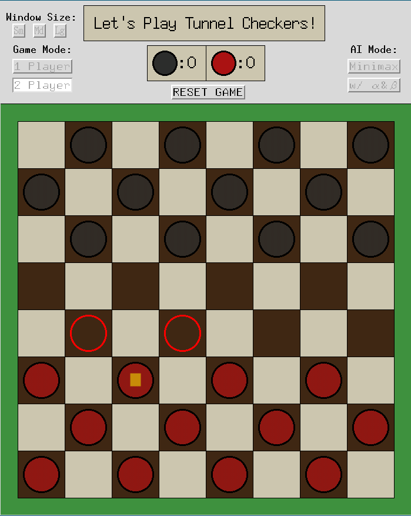

### After clicking on a move
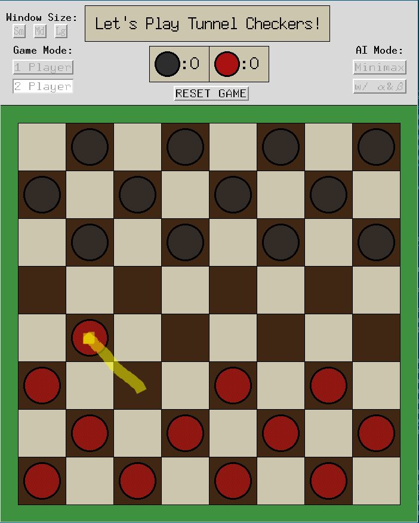

### Elimination move available
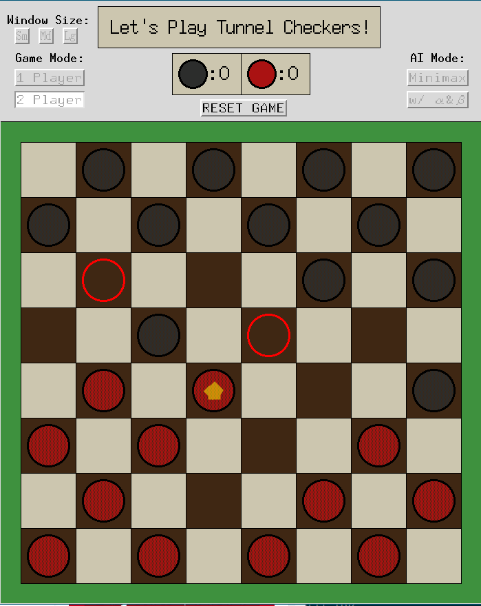

### After elimination move
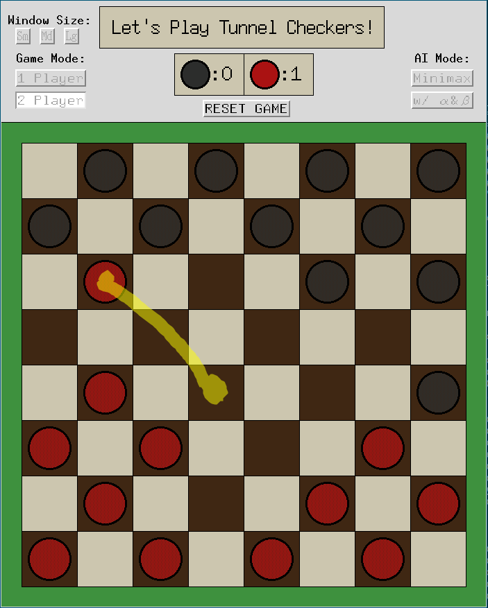

### Chain elimination move available
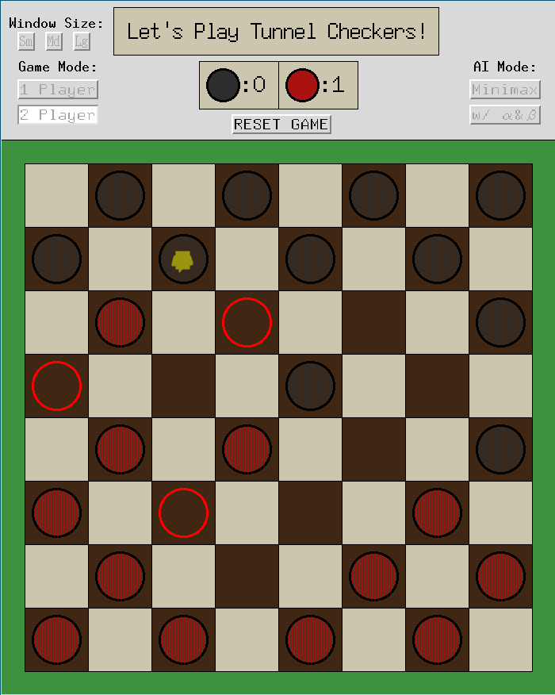

### After chain elimination move
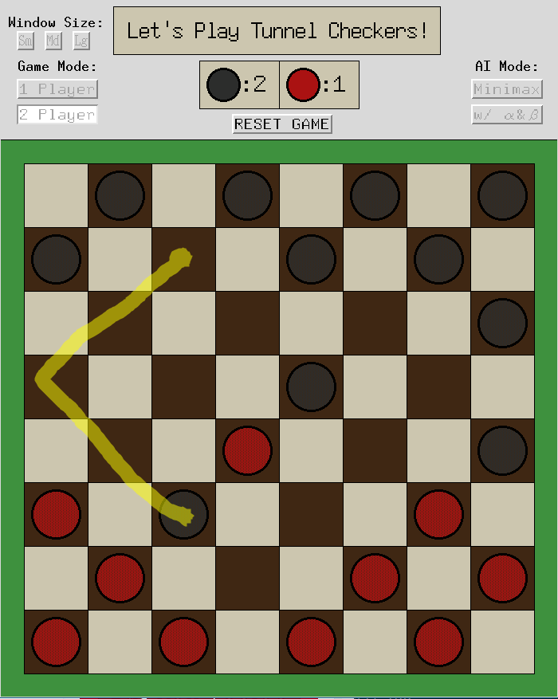

### Over lateral edge move available
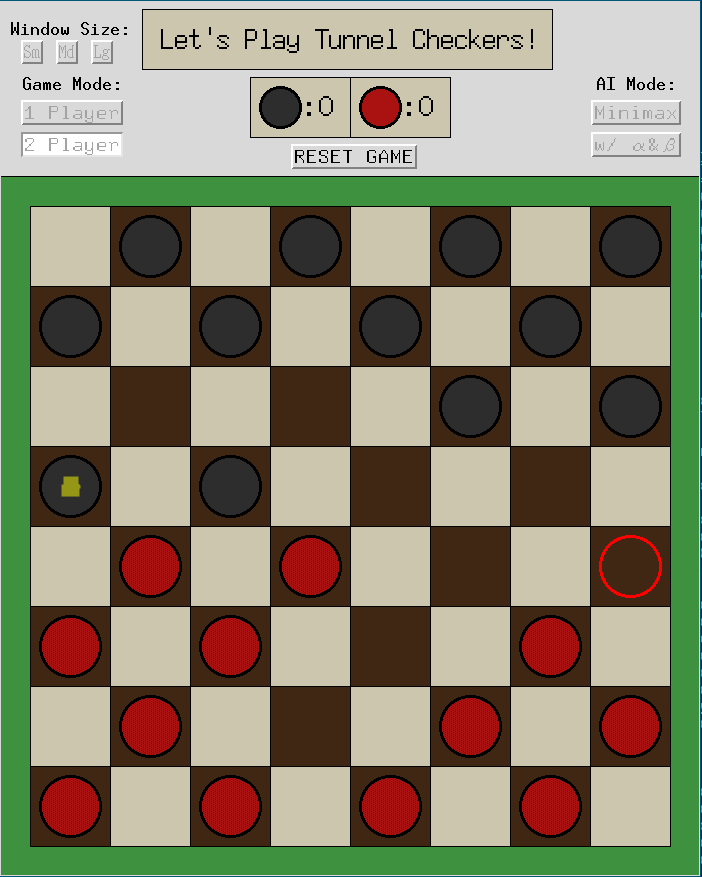

### After over lateral edge move
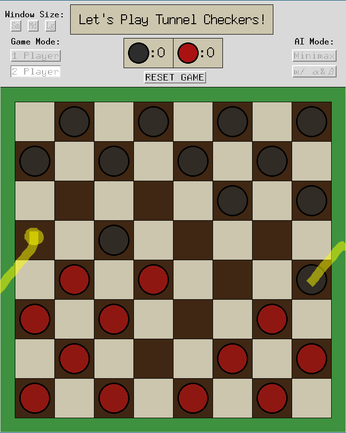

### A piece becomes a king
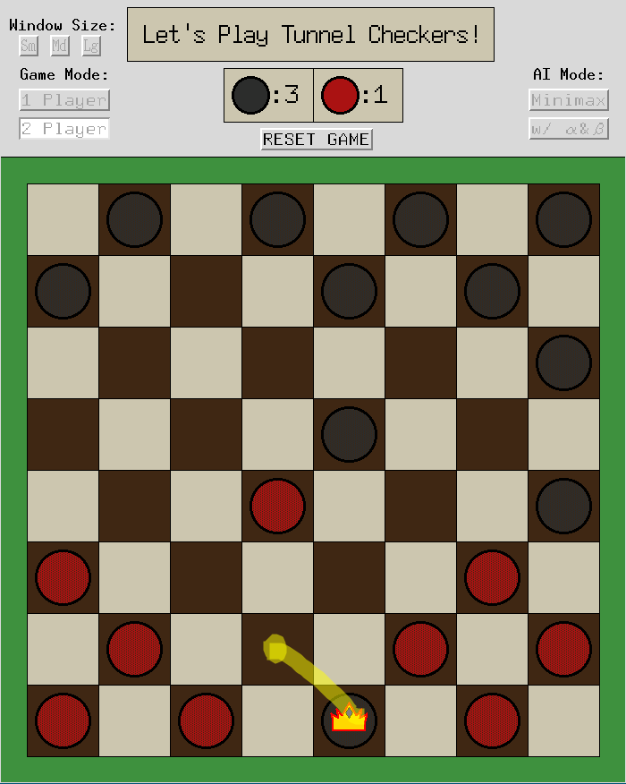

### King's available move


## Getting Started

**Compatibility has been confirmed in Linux OS(Ubuntu 16.04.4 LTS) and macOS High Sierra 10.13.3**

**If you aren't unsure :dizzy_face: :broken_heart: of having Python3 installed on your machine, please follow the Prerequisites instructions first before following Getting Started instructions :grin:**

How to run the game:

1. Open macOS or Linux terminal and navigate to a directory where you want to clone this repository.
```
user@user-machine: cd ~/Desktop
```
2. Then, use the following commands to clone this repository.
```
user@user-machine: git clone https://github.com/SHoonL/Tunnel-Checkers.git
```
3. Navigate in to Tunnel-Checkers directory and run the game.
```
user@user-machine: cd Tunnel-Checkers
user@user-machine: ls -ah
user@user-machine: python3 CheckerGame.py
```
4. The AI is pretty challenging to beat although the minimax recursion depth setting is only two. I hope you enjoy the game!

### Prerequisites

So you are not sure if you got Python3 installed on your machine? Let's see what we got. Type in the follow command in your terminal.
```
user@user-machine: python --version
```
The output from my machine is as follows
```
Python 3.6.4 :: Anaconda, Inc.
```
If the output from your machine is anything lower than Python 3.x.x please type in the following commands to update Python version on your machine.

macOS:
```
user@user-machine: brew update
user@user-machine: brew install python3
```
Linux OS(Ubuntu):
```
user@user-machine: sudo apt-get update
user@user-machine: sudo apt-get install python3
```

## Authors

**Seung Hun Lee** - *Initial work*
Contact: lee.seunghu@husky.neu.edu :mailbox:
[Github Page](https://github.com/shoonl)
[Personal Webpage](https://shoonl.com)

**Please feel free to contact me for any feedback or comments! :pray:**
